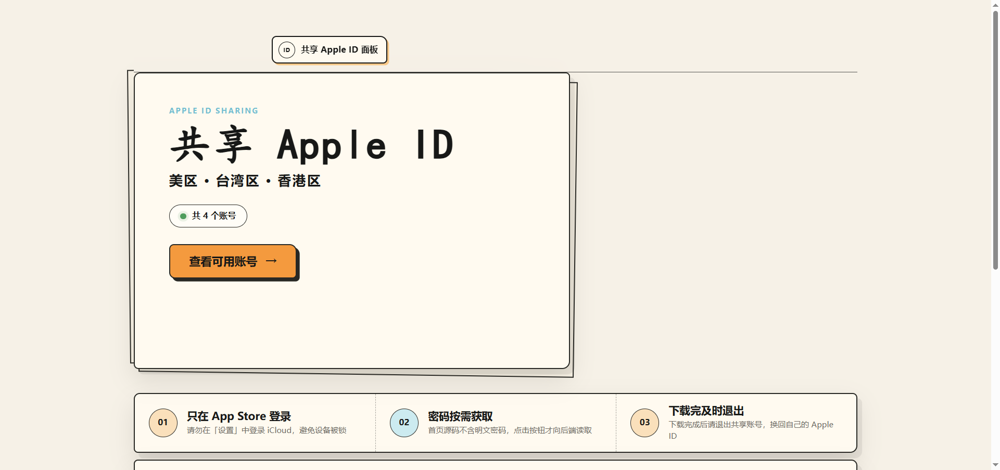
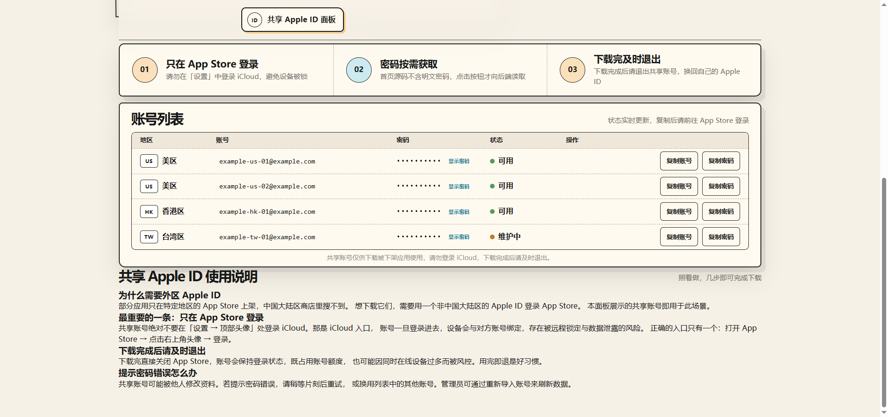

# 共享 Apple ID 面板（Shared Apple ID Panel）

[](https://github.com/Leo-bot66/shared-id-panel/actions/workflows/docker-publish.yml)
[](LICENSE)
[](package.json)

[English](README.en.md) | 简体中文

一个**自托管的共享 Apple ID 展示面板**：导入账号 → 打开网页 → 访客即可查看各区域账号的实时状态并复制使用。

面向需要给用户分发**共享 Apple ID**（用于在 App Store 下载小火箭 Shadowrocket、Quantumult X 等被下架应用）的场景，开箱即用。

## 📷 预览

| 首页 | 账号列表 |
|---|---|
|  |  |

```
导入账号（JSON/CSV）  →  node cli/import.js accounts.json
启动服务              →  docker compose up -d
访问                  →  http://localhost:3000
```

---

## ✨ 特性

| 特性 | 说明 |
|---|---|
| **零配置起步** | 一条命令建库、一条命令导入、一条命令启动，无需写代码 |
| **密码按需下发** | 首页 HTML **不含任何明文密码**，点击「显示密码」才向后端读取 —— 批量抓取首页拿不到密码 |
| **地区分组** | 自动生成 US / HK / TW / JP 等地区徽章，支持任意自定义地区名 |
| **状态徽章** | `available` / `unavailable` 两态可视化，前端自动区分颜色 |
| **一键复制** | 复制账号、复制密码（密码取回后自动写入剪贴板） |
| **SEO 友好** | 服务端渲染（非纯 SPA）、自动生成 canonical / OG / JSON-LD，对搜索引擎可直接读取 |
| **Docker 一键部署** | 附带 `Dockerfile` 与 `docker-compose.yml`，数据落盘在宿主机 |
| **轻量** | Node + Express + SQLite，无外部依赖，内存占用低 |

---

## 🚀 快速开始

### 方式一：Docker（推荐）

```bash
git clone https://github.com/Leo-bot66/shared-id-panel.git
cd shared-id-panel

# 导入账号（会创建 data/panel.db）
docker compose run --rm panel node cli/import.js examples/accounts.sample.json

# 启动
docker compose up -d
```

打开 `http://localhost:3000`。

### 方式二：本地运行

需要 Node.js 18 或更高版本。

```bash
npm install
cp .env.example .env          # 按需修改站点名称等

node cli/import.js examples/accounts.sample.json
npm start
```

---

## 📥 导入账号

支持 **JSON**、**CSV**，以及从标准输入读取。

```bash
node cli/import.js accounts.json       # JSON 数组
node cli/import.js accounts.csv        # CSV（首行表头）
cat accounts.json | node cli/import.js -   # 标准输入

node cli/import.js accounts.json --dry-run          # 只解析不写库
node cli/import.js accounts.json --region 美区      # 给缺省记录设默认地区
```

### JSON 字段

```json
[
  {
    "email": "account@example.com",
    "password": "YourPassword",
    "region": "美区",
    "status": "available",
    "note": "备注（可选）",
    "sort_order": 10
  }
]
```

| 字段 | 必填 | 说明 |
|---|---|---|
| `email` | ✅ | 账号（别名：`account` / `username` / `mail`） |
| `password` | ✅ | 密码（别名：`pwd` / `pass`） |
| `region` | — | 地区，默认 `未分区`（别名：`country` / `area`） |
| `status` | — | `available` / `unavailable` / `hidden`，默认 `available` |
| `note` | — | 备注（别名：`remark` / `comment`） |
| `sort_order` | — | 排序权重，越小越靠前 |

> **重复导入会按 `email` 覆盖更新**，因此可以定期把最新账号列表整批导入，密码变了会自动同步。

---

## ⚙️ 配置

全部通过环境变量（或 `.env` 文件）配置：

| 变量 | 默认值 | 说明 |
|---|---|---|
| `PORT` | `3000` | 监听端口 |
| `SITE_NAME` | `共享 Apple ID 面板` | 站点名（用于标题、OG） |
| `SITE_URL` | `http://localhost:3000` | 站点完整地址，**影响 canonical 与分享链接，务必按实际域名填写** |
| `SITE_DESCRIPTION` | 见 `.env.example` | 页面描述（用于 meta description） |
| `DATA_DIR` | `./data` | SQLite 存放目录 |
| `REVEAL_ON_CLICK` | `true` | **`true` = 首页不下发明文密码**，点击按钮才按需请求。建议保持开启 |
| `SHOW_UPDATED_AT` | `true` | 是否展示账号更新时间 |
| `FOOTER_NOTE` | 见 `.env.example` | 账号列表下方的免责声明 |

---

## 🔌 API

便于接入你自己的前端或自动化脚本。

| 方法 | 路径 | 说明 |
|---|---|---|
| `GET` | `/api/accounts` | 账号列表（`REVEAL_ON_CLICK=true` 时**不含** `password` 字段） |
| `GET` | `/api/accounts/:id/password` | 按需获取单个账号的密码 |
| `GET` | `/healthz` | 健康检查，返回账号统计 |

```bash
curl http://localhost:3000/api/accounts
# {"ok":true,"total":4,"data":[{"id":1,"email":"...","region":"美区","regionCode":"US","status":"available"}]}

curl http://localhost:3000/api/accounts/1/password
# {"ok":true,"data":{"id":1,"password":"..."}}
```

---

## 🔒 安全设计说明

这类站点最容易被「批量抓取密码」。本项目在默认配置下做了两层规避：

1. **服务端不渲染明文密码** —— `REVEAL_ON_CLICK=true` 时，首页 HTML 与 `/api/accounts` 均不含 `password` 字段，密码只能通过 `/api/accounts/:id/password` 逐个获取。
2. **响应禁用缓存** —— 密码接口返回 `Cache-Control: no-store`。

> ⚠️ 但要清醒认识：**这只提高了抓取成本，不是安全边界**。任何能直接访问 `/api/accounts/:id/password` 的人都能拿到密码。
> 如果你的场景需要更强的保护，请在反向代理层（Nginx / Cloudflare）自行叠加：
> **限速**（如单 IP 每分钟 10 次）、**人机验证**（Turnstile）、**IP 黑名单**。

---

## 📁 目录结构

```
shared-id-panel/
├── server.js                  # Express 入口（页面 + API）
├── src/
│   ├── config.js              # 环境变量配置
│   └── db.js                  # SQLite 初始化与数据访问
├── views/
│   └── index.ejs              # 首页模板（服务端渲染）
├── public/static/
│   ├── css/                   # 样式
│   └── js/panel.js            # 前端交互（按需取密、复制）
├── cli/import.js              # 账号导入 CLI
├── examples/                  # 示例数据
├── Dockerfile
├── docker-compose.yml
└── .env.example
```

---

## ❓ 常见问题

**Q：这个项目能自动更新账号密码吗？**
不能，也不打算做。本项目只负责**展示**，账号来源由你自己维护（手动整理 / 上游 API / 自己写脚本），通过 `import` 命令整批导入即可。把「获取账号」和「展示账号」分开，是刻意的边界设计。

**Q：支持多用户 / 登录吗？**
不支持。这是一个纯展示面板，没有后台与账号体系。需要访问控制请用 Nginx Basic Auth 或 Cloudflare Access 挡在前面。

**Q：为什么不做成纯前端（SPA）？**
服务端渲染对搜索引擎更友好。同类站点的目标是让人**搜得到**，SPA 空壳在这一点上先天吃亏。

**Q：数据存在哪？**
`data/panel.db`（SQLite）。Docker 部署时已挂载到宿主机 `./data`，容器重建不丢数据。

---

## 📄 免责声明

本项目仅为**技术演示与自托管工具**，不提供、不托管、不分发任何 Apple ID 账号数据。
使用者应自行确保所展示的账号来源合法、使用方式符合 Apple 的服务条款及当地法律法规。
因使用本项目产生的任何后果，由使用者自行承担。

## License

[MIT](LICENSE)
